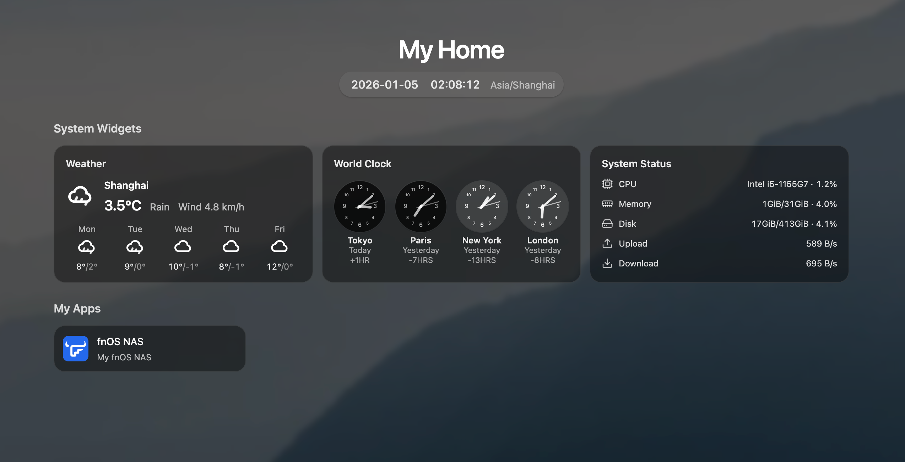

# Hearth

Hearth is a lightweight home dashboard for self-hosted services.



- Backend: Go + SQLite
- Frontend: React (Vite)
- Features: grouped app links, built-in widgets (weather / world clock / system status), background wallpaper

## Run with Docker

### Docker CLI

```bash
docker pull cailurus/hearth:latest

docker run -d \
	--name hearth \
	-p 8787:8787 \
	-v hearth-data:/data \
	--restart unless-stopped \
	cailurus/hearth:latest
```

Open `http://localhost:8787`.

Data is stored under `/data` inside the container (mounted to the volume above).

### Docker Compose

```yaml
services:
	hearth:
		image: cailurus/hearth:latest
		ports:
			- "8787:8787"
		volumes:
			- hearth-data:/data
		restart: unless-stopped

volumes:
	hearth-data:
```

## Download & Run (Local)

Prerequisites: Go and Node.js.

### Build from source

The build includes the web frontend. `make build` will run `npm ci` inside `web/` and then build the Go binary.

```bash
git clone https://github.com/cailurus/Hearth
cd Hearth

# Optional: start from a clean state
# make clean

make build
./dist/hearth
```

Open `http://localhost:8787`.

Default admin login: `admin` / `admin`.